# 多模智诊：多模态统一接口设计的疾病辅助诊断系统

## ✨ 项目简介

**多模智诊** 是一个基于统一接口设计的多模型、多模态大模型医学辅助诊断智能体系统，顺应当前大模型开发发展的最新方向 —— MCP（模型上下文协议）。将mcp引入多模态模型医学诊断里。该系统在高效低成本的前提下，突破传统 VLM 微调模型的单一性和“只能粗略描述图像”的局限，支持精细图像处理与标记。实现多个垂直领域的医学疾病诊断，能根据体检数值精准拟合，能根据临床症状准确推理疾病，幻觉率低。性价比和效果超过流行的moe模型，特别适用于医学场景中辅助医生高效、精准地完成诊断任务。并且适配医院有限算力的环境，并且可以实现全链路本地化保证患者隐私

---

## 🎯 实现目标与核心功能
- 我们的预期目标是开发一个多模态大模型疾病诊断系统，并且设计模块化易于管理升级，能解决正常多模态大模型无法精准数据回归拟合和无法处分割标记理图像问题，还有训练后的大模型单一性强，功能切换不友好的问题，以及对于临床症状诊断疾病存在幻觉的问题。并且要照顾到医院这种特殊的环境，无论是硬件还是软件上的。
- 本系统融合图像、文本、数值等多模态输入，支持对医学影像、化验指标及临床症状进行全面诊断，用MCP技术在小参数模型上实现类似moe模型选择特定“专家网络”激活的效果（选择激活特定外挂网络模型），但是算力依赖低，返回效果更好，训练维护成本低。具备以下主要功能：

### 📷 图像类诊断
- ✨**脑部CT肿瘤分割**：识别并精确分割脑部肿瘤区域。
- 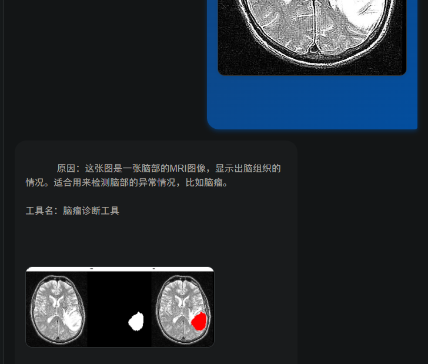
- ✨**肾脏CT肿瘤分割**：分割肾脏的正常组织与肿瘤组织。
- 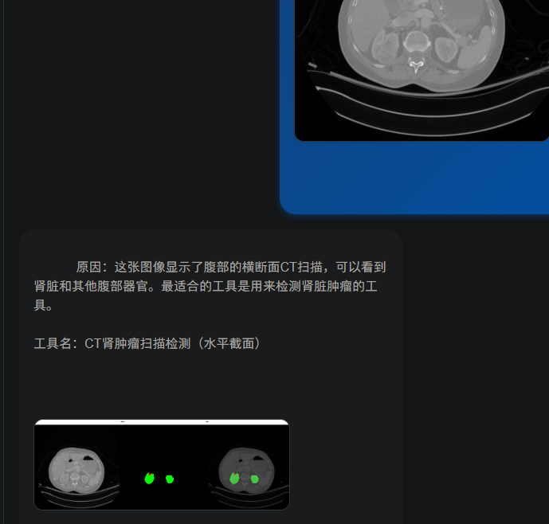
- ✨**皮肤镜图像皮肤癌诊断**：良性/恶性分类。
- 
- 
- ✨**眼底图像血管分割**：通过裂隙灯图像精准标注眼底血管。
- 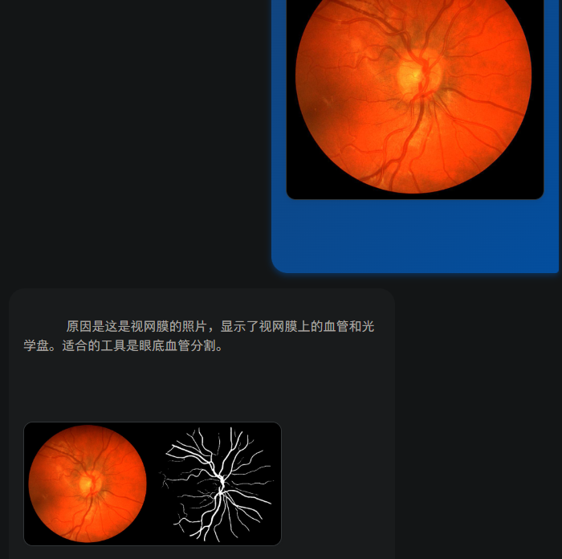
- ✨**肺炎检测**：使用肺部X光图像判断是否患有肺炎。
- 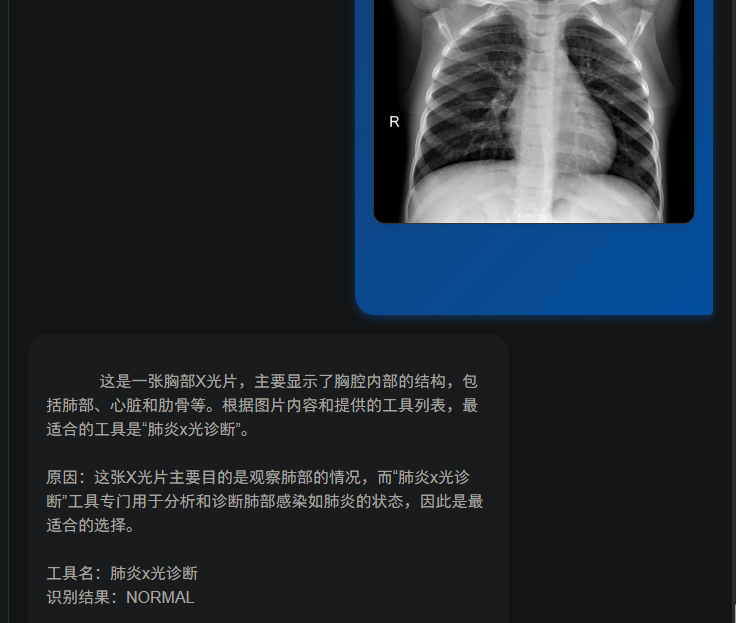
- 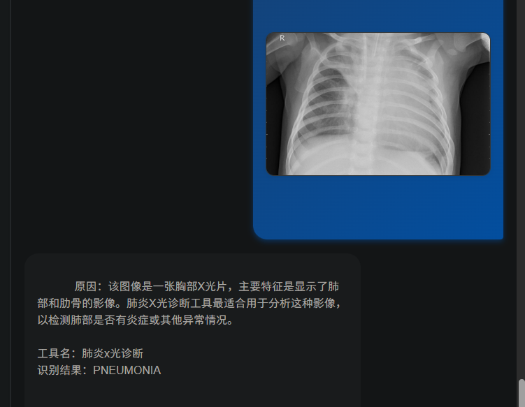
- ✨**肾结石定位**：X光图像中精确检测与标记结石位置，避免遗漏。
- 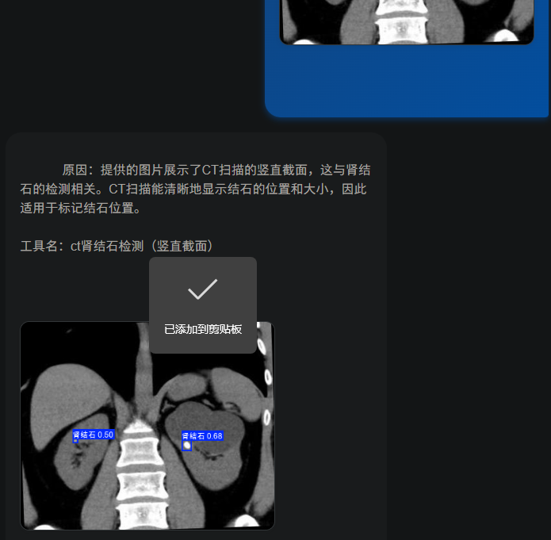
- ✨**血液细胞图像标注**：细胞图像中自动标记异常或特征细胞。
- 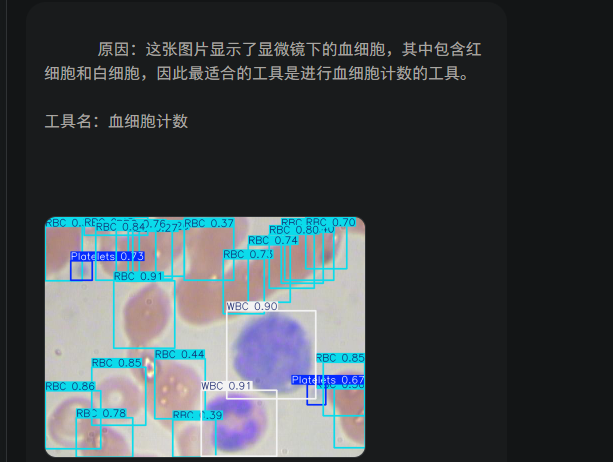
- ✨**角膜扫描辅助判断**：根据角膜扫描图像诊断脉络膜新生血管，糖尿病性黄斑水肿，玻璃膜疣等疾病。
- 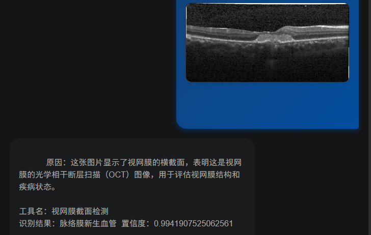
### 🧪 化验指标类诊断
- ✨**糖尿病辅助诊断**：根据生化指标判断为“无糖尿病 / 早期 / 确诊”。
- 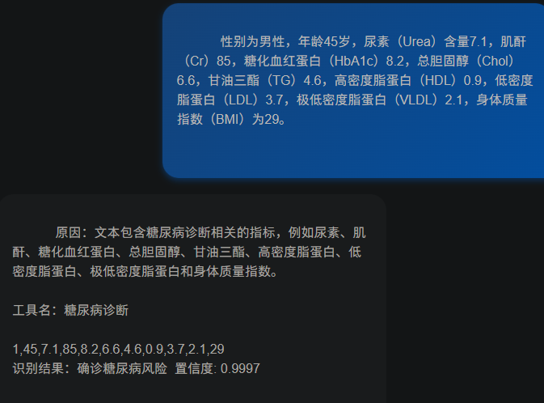
- ✨**心脏病辅助判断**：根据体检数据预测患病概率与置信度。
- 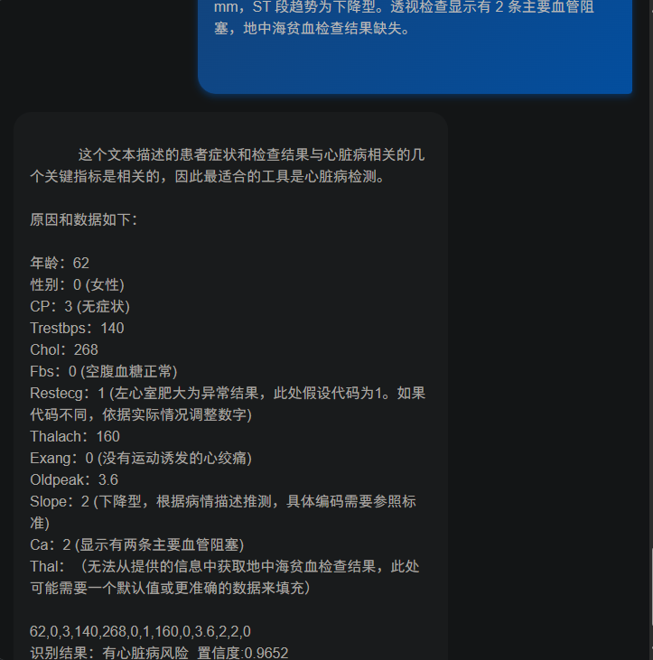
### 💬 临床症状文本诊断
- ✨**自然语言症状诊断疾病**：从描述中预测可能疾病，低幻觉输出，附带置信度评分。
- 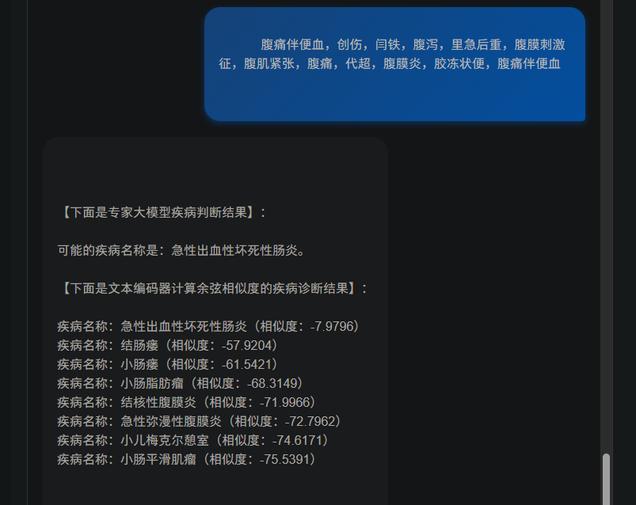

---

## 🛠️ 系统设计与技术实现

### ✨ 核心理念：MCP模型上下文协议以及对应工具的运用

本系统借鉴 MCP（Model Context Protocol）思想，告别“一个模型做一件事”的旧方式。通过引导训练大模型在不同任务中智能调用对应的小模型（工具），实现多任务协同与精准处理。
从底层代码起步搭建了一个智能体，相比主流框架可控性强，支持更个性化的开发方案

### 🔧 技术实现流程

1. **系统架构与统一接口设计**
   - 设计模块化、高拓展性的统一接口，降低维护成本，提升复用性。

2. **功能选定与数据构造**
   - 根据目标任务（如肿瘤分割、糖尿病诊断）构建多模态数据集，涵盖图像、数值、文本等形式。
   - 并且考虑到医疗场景人命关天，我们在临床症状诊断不使用容易失效并且效果不好的rag，而直接使用微调的模型，性能效果更好

3. **小模型训练与集成**
   - 针对不同任务训练小模型：
     - 图像处理类：YOLO、ViT、UNet 等。
     - 数值/文本类：MLP、text2vec-base-chinese、XGBoost 等。

4. **接口封装与工具调用**
   - 使用统一封装方式，将各小模型封装为工具函数，供大模型智能调用。

5. **前端交互系统设计**
   - 提供人性化可视化界面，实现任务切换、结果查看、图像标记展示等功能。
6. **具体实现请见最后**
---

## 💡 创新点与优势

-  **MCP理念引入**：打破传统 VLM 微调限制，模型调用工具自动化。
-  **图像可交互标注**：能返回分割/检测结果图，远优于纯语言生成。
-  **精确回归与低幻觉**：融合传统模型数值预测优势与大模型理解能力。
-  **模块化接口架构**：各小模型独立可插拔，系统维护与扩展便捷。
-  **本地推理支持**：小模型可在 CPU 运行，适配医院普通设备。
-  **患者隐私保护**：支持全本地部署，无需上传数据至云端。
-  **数据回收利用**：工具模型迭代成本低，可以将新产生的数据再训练模型。
-  **优于moe模型**: moe模型参数大，不管是训练还是推理成本都不可控（尽管moe模型选择激活参数），并且后续添加功能并不方便。

---

## 🔭 应用前景

本系统适用于：

- 🏥 各级医院的医学辅助诊断系统，降低医生误诊率。
- 🧪 医疗科研机构，作为多模态智能模型研究平台。
- 🧑‍⚕️ 基层诊所，借助低算力本地推理保障诊断效果。
- 🔐 高隐私要求场景，通过模型蒸馏全链路本地运行。

---

## 🎈具体实现方式
- 首先是基座大模型的微调，使用llama factory微调即可，使用图文对+文本对形式数据集训练模型选择合适的工具（为了方便部署，github版本使用硅基流动api）
- 纯临床症状推理疾病，第一种是结构化症状疾病文字对，微调qwen2.5-72b。第二种方式是使用text2vec-base-chinese给病例数据集编码，然后检索相似向量

